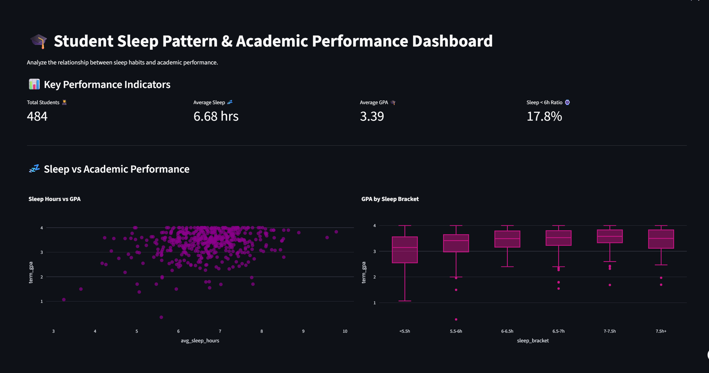
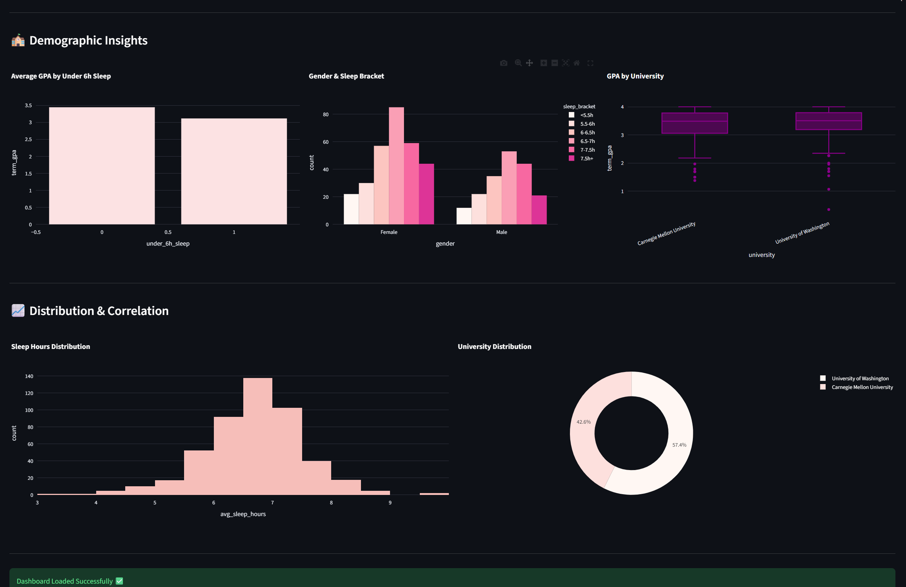

# 🎓 Student Sleep Pattern & Academic Performance Dashboard

An interactive dashboard built with **Streamlit** to analyze the relationship between students' sleep habits and academic performance. The dashboard provides interactive visualizations that help explore how sleep patterns influence students' academic performance.

---

## 🚀 Live Demo

🔗 https://student-sleep-pattern-dashboard-cti98hxjvuigvruplvrs63.streamlit.app   

---

## 📸 Dashboard Preview

### Dashboard Overview



<br>



---

## 📊 Features

- 📈 Interactive KPI Cards
- 😴 Sleep Hours vs. GPA Analysis
- 📦 GPA Distribution by Sleep Bracket
- 📉 Average GPA for Students Sleeping Less Than 6 Hours
- 👥 Gender & Sleep Bracket Distribution
- 🏫 GPA Comparison Across Universities
- 📊 Sleep Hours Distribution
- 🍩 University Distribution

---

## 🛠️ Technologies Used

- Python
- Streamlit
- Pandas
- Plotly
- NumPy
- Matplotlib
- Seaborn

---

## 📂 Dataset

**college_sleep_and_gpa.csv**

---

## ▶️ Run Locally

```bash
pip install -r requirements.txt
streamlit run app.py
```

---

## 📁 Project Structure

```text
student-sleep-pattern-dashboard/
│
├── app.py
├── college_sleep_and_gpa.csv
├── requirements.txt
├── README.md
└── screenshots/
    ├── dashboard_top.png
    └── dashboard_bottom.png
```

---

## 👨‍💻 Author

**Abdelaziz Elshourbgy**

- **GitHub:** https://github.com/AbdelazizElshourbgy-ui
- **LinkedIn:** https://www.linkedin.com/in/abdelaziz-elshourbgy-b126a83a2/
